# 物联网为什么不用 HTTP？MQTT 完整教程

> **视频来源**：[哔哩哔哩 - 物联网为什么不用 HTTP？MQTT 完整教程](https://www.bilibili.com/video/BV19YtV6NE9t/)  
> **视频时长**：13 分 21 秒  
> **核心总结**：极小报文开销 + 长连接发布订阅 + 三档服务质量（QoS）保证 + 状态保活与遗嘱机制，这就是 MQTT 为资源受限设备与弱网环境提供的最优解。

---

## 一、为什么物联网不用 HTTP？

在传统 Web 架构中，HTTP 是绝对的通用协议，但在物联网（IoT）海量设备连接场景下，HTTP 暴露了致命的技术短板：

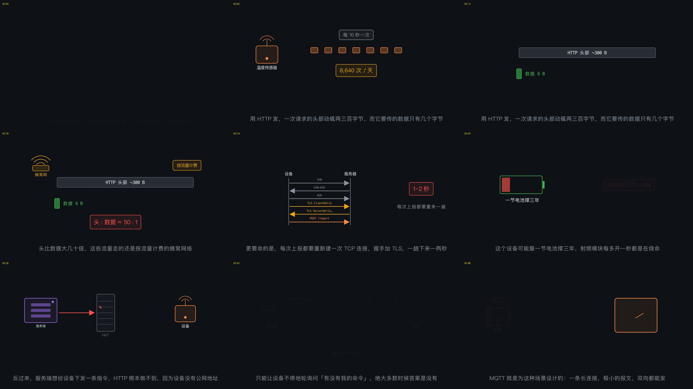

### 1. 报文头体积畸大，流量与带宽严重浪费
* **典型场景**：一个温度传感器每 10 秒采集一次数据并上报，一天需上报 86,400 次。
* **数据对比**：传感器实际要传输的有效载荷（Payload）仅有几字节（如 `23.5`），而一个标准 HTTP 请求头的开销动辄 **200 ~ 300 字节**。头部开销是实际数据的几十倍到上百倍。在按流量计费（蜂窝蜂窝网络/NB-IoT/4G Cat.1）的环境下，带来高昂的资金成本。
* **MQTT 对比**：MQTT 固定报头最小只有 **2 字节**，报文开销降低了数个数量级。

### 2. 频繁握手与 TLS 开销过大，严重消耗电池寿命
* **HTTP 短连接代价**：每次数据上报都要经历 TCP 三次握手 + TLS 安全握手，一趟网络往返至少耗费 1~2 秒。
* **功耗杀手**：低功耗物联网设备通常由一节电池供电并期望工作数年。通信中最耗电的环节不是 CPU 计算，而是**射频发射模块（RF）处于工作态的时长**。HTTP 每次上报频繁唤醒、长时间开启射频模块，会剧烈消耗设备寿命。

### 3. 无公网 IP 与 NAT 阻隔，服务端无法主动下发
* **无法双向主动通信**：IoT 终端绝大多数部署在局域网内，通过运营商 NAT（网络地址转换）访问公网，没有独立的公网 IP 地址。服务端根本无法直接发起 HTTP 请求主动控制设备。
* **HTTP 轮询的死胡同**：若采用 HTTP 轮询（Polling）查询下发指令，绝大多数轮询得到的都是空响应（304 或空内容），造成极大的网络拥堵与电量损耗。

---

## 二、受限设备（Constrained Devices）的四大硬约束

MQTT 协议所有的底层设计细节，都是在精准回应受限设备的四项严苛约束：

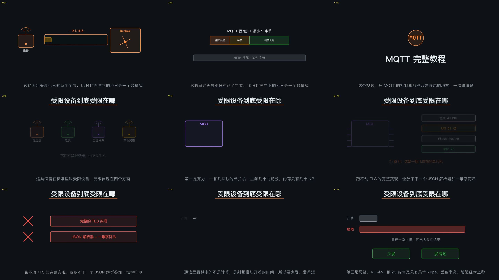

| 约束维度 | 物理现实 | MQTT 的应对设计 |
| :--- | :--- | :--- |
| **1. 算力与内存受限** | 几元钱的低成本 MCU/单片机，主频仅几十 MHz，内存（RAM）仅几十 KB。跑不动庞大的 TLS 完整栈，放不下复杂的 JSON 解析器。 | 极简二进制报文格式，解析占用极低，C 语言轻量客户端只需数 KB 内存。 |
| **2. 电池供电长效** | 依靠电池供电，要求无维护稳定运行几个月甚至数年。射频开启极其耗电。 | 单一持久长连接，心跳保活极短，少发、短发、发完即休眠。 |
| **3. 弱网与 NAT 穿透** | NB-IoT / 2G / 蜂窝网络带宽通常仅几十 kbps，丢包率高，延迟常达数秒；设备隐藏在 NAT 后。 | 基于客户端主动向 Broker 建立长连接，实现双向消息推送；具备协议级重传机制。 |
| **4. 海量并发规模** | 单个平台或集群可能需要同时承载几十万到数百万个并发连接。 | 纯路由器架构，轻量会话管理，易于做横向分布式集群扩展。 |

---

## 三、发布/订阅（Pub/Sub）模式与时空解耦

HTTP 是严格的客户端-服务端**点对点强耦合**请求-响应模型；而 MQTT 彻底打破这种依赖，采用 **发布/订阅（Publish/Subscribe）** 模式。

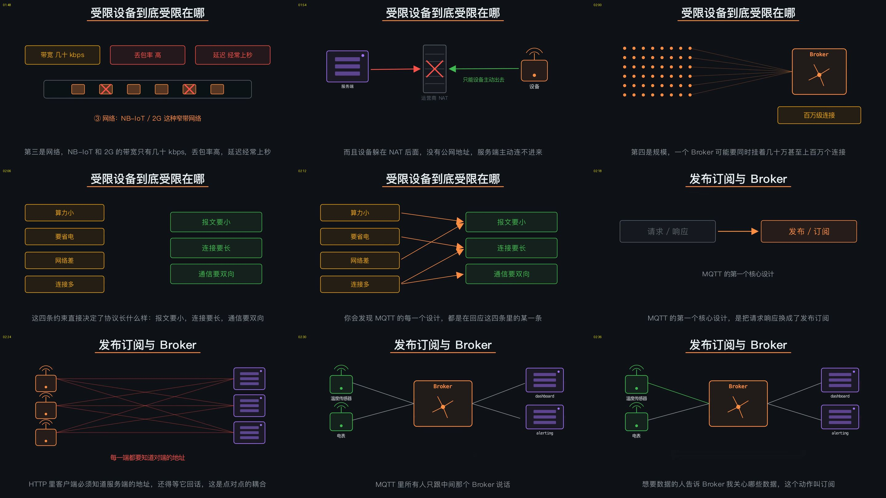

### 1. 核心模型
* **Broker（代理服务端）**：系统中所有节点只与中央 Broker 建立一条 TCP 长连接。
* **发布者（Publisher）**：将数据推送到 Broker 上指定的 Topic。
* **订阅者（Subscriber）**：向 Broker 声明自己关心的 Topic。
* **Broker 职责**：收到某主题的发布消息后，根据订阅路由表，自动扇出分发给所有订阅了该主题的客户端。

### 2. 双重解耦优势
1. **空间解耦（Spatial Decoupling）**：发布者完全不需要知道谁在接收数据，订阅者也无需知道是谁产生的。当系统新增业务消费端（如大数据分析、告警模块）时，设备端无需做任何代码修改与配置变动。
2. **时间解耦（Temporal Decoupling）**：订阅方即便当前不在线，Broker 也可以通过持久会话暂存消息，待其上线后补发。

### 3. Broker 中枢与高可用集群选型
> [!WARNING]
> Broker 成为整个系统的单点中枢，Broker 宕机将导致全网瘫痪。因此，**生产环境必须部署 Broker 分布式集群**。

* **主流成熟 Broker**：
  * **EMQX**：国内广泛采用、基于 Erlang 高并发构建的超大规模分布式物联网接入平台。
  * **HiveMQ**：海外车联网及工业物联网巨头常用的企业级集群解决方案。
  * **NanoMQ / Mosquitto**：轻量级 Edge/边缘侧 Broker。
* **工程考量**：集群并非简单加机器，节点之间必须实时同步海量订阅树路由状态，节点数扩张存在内网复制开销。

---

## 四、主题（Topic）分层设计与通配符规则

Topic 是 MQTT 消息路由的“地址”，它不是在服务端预先配置创建的实体，而是**随发随有**的轻量级斜杠分层字符串。

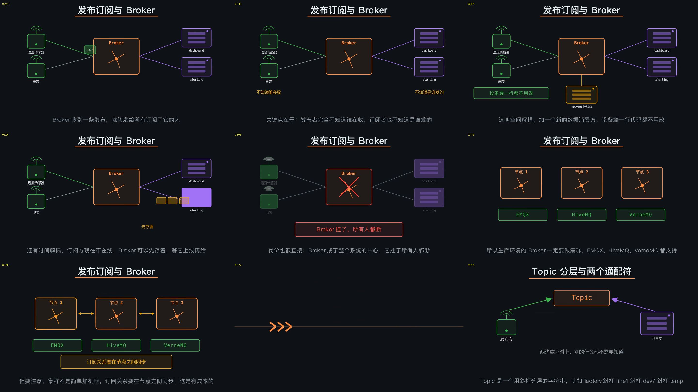

### 1. Topic 分层结构规范
* 采用 `/` 进行层级拆分，建议遵循**从宏观到微观、从固定到可变**的命名原则：  
  `[区域/工厂] / [产线/部门] / [设备类型] / [设备唯一标识] / [指标或功能]`  
  * *示例*：`Factory1/LineA/Device01/temp`

### 2. 订阅通配符
* **单层通配符 `+`**：只能匹配某一个层级的任意内容，可放置在层级的任意位置。
  * *示例*：`Factory1/LineA/+/temp` 可以订阅到 1 号产线上所有设备的温度数据。
* **多层通配符 `#`**：匹配当前层级及其后方所有的子层级。
  * *示例*：`Factory1/#` 可以订阅到整个 Factory1 工厂产生的所有消息。
  * **铁律**：`#` **必须放在 Topic 的最后一层**，不能写成 `Factory1/#/temp`。

### 3. Topic 设计防坑指南
* ❌ **错误做法：把设备 ID 放在第一层**（如 `Device01/Factory1/temp`）。这会导致上层系统根本无法利用通配符按产线或区域做聚合订阅。
* ❌ **严禁把易变数据塞入 Topic**：严禁在 Topic 中包含时间戳、动态随机值或版本号（如 `Factory1/LineA/temp/20260921`）。这会导致通配符彻底失效，Topic 字典在 Broker 内存中无限膨胀。

---

## 五、深入剖析：三档 QoS 投递质量与“QoS 2 陷阱”

MQTT 定义了 3 个等级的投递质量保证（Quality of Service）。

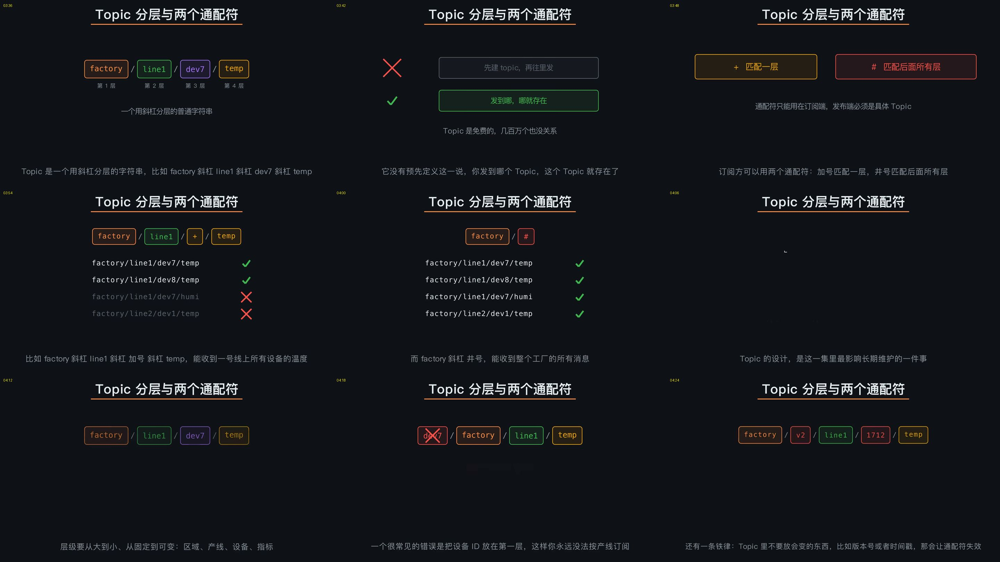

### 1. QoS 0：最多一次（At most once）
* **流程**：`PUBLISH` 发出后立即结束，不确认，不重传。
* **开销**：单向 1 个报文。
* **适用场景**：高频周期性采集的时序遥测数据（如秒级温湿度上报），偶尔丢失几个点无伤大雅，下个周期立刻会有新数据刷新。

### 2. QoS 1：至少一次（At least once）
* **流程**：发送方发出 `PUBLISH`，必须等待接收方回复 `PUBACK`。如果在计时器超时后未收到确认，则置位 `DUP` 标志重发。
* **特性**：能够保证消息不丢失，但在网络丢包或确认报文丢失时，接收方可能会收到**重复消息**。
* **工程配合**：**业务层必须实现幂等性（Idempotency）**。

### 3. QoS 2：恰好一次（Exactly once）
* **流程**：通过完整的**四步握手**严格保证消息不重不漏：
  1. `PUBLISH`（发送方发数据）
  2. `PUBREC`（接收方收到并记录）
  3. `PUBREL`（发送方释放消息）
  4. `PUBCOMP`（接收方完成处理）

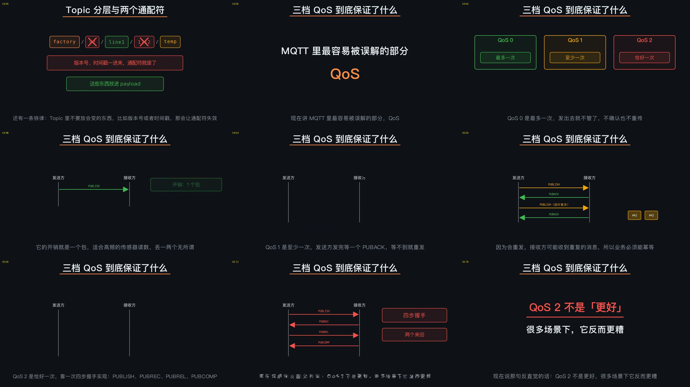

### 4. 警惕反直觉的“QoS 2 陷阱”
很多初学者误以为“QoS 等级越高越好，生产必须上 QoS 2”，这在物联网领域是极其危险的认知：
* **时延与电量剧增**：QoS 2 的四步握手包含两次完整网络往返（RTT）。在弱网、丢包率高、上行延迟长达秒级的网络中，任何一步握手报文丢包都将触发重试，不仅拉长业务延迟，还会成倍消耗设备电池。
* **逐段生效原则（Hop-by-hop QoS）**：
  $$\text{端到端有效 QoS} = \min(\text{发布端到 Broker 的 QoS}, \text{Broker 到订阅端的 QoS})$$
  若设备发布时为 QoS 2，而监控中心订阅时配置为 QoS 0，最终消费者依然只享受到 QoS 0 的保障。

> [!TIP]
> **工业实践黄金法则**：
> * **遥测遥信类数据**：一律采用 **QoS 0**，以最小开销换取实时吞吐。
> * **下发控制指令与关键告警**：采用 **QoS 1 + 业务层去重 ID（幂等处理）**。
> * 极度严苛的扣费或结算场景，应在业务逻辑层实现状态机和事务去重，而非寄希望于协议层 QoS 2。

---

## 六、状态维护机制：保留消息（Retain）与遗嘱消息（LWT）

MQTT 针对设备掉线与状态同步，原生提供了两项杀手级特性：

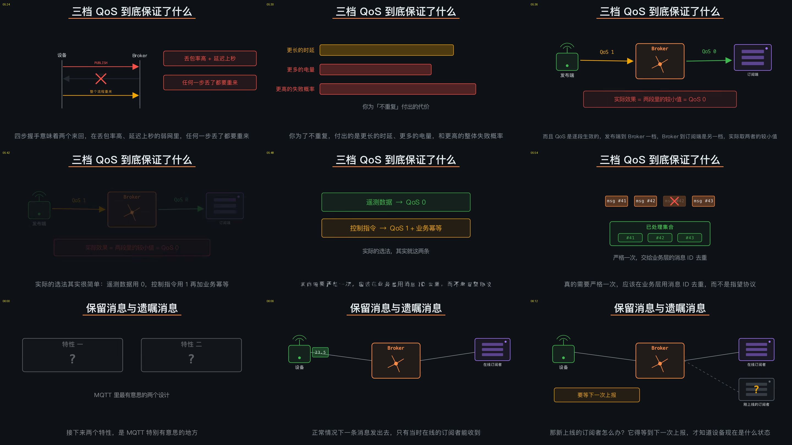

### 1. 保留消息（Retained Message）
* **解决痛点**：默认情况下，消息只投递给发布瞬间在线的订阅者。如果传感器 1 小时上报一次，手机 App 刚打开登录，就必须傻等 1 个小时才能看到当前状态。
* **工作机制**：发布消息时将 `retain` 标志置为 `true`。Broker 会将该主题下的**最后一条**保留消息持久保存在内存/磁盘中。
* **效果**：未来无论何时有新的客户端订阅此 Topic，Broker **会在订阅成功的瞬间立即将该条保留消息主动推送给它**。
* **使用边界**：
  * ✅ **正确用法**：存储最新“设备静态或准静态状态”（如当前开关是开是关、当前最新配置、当前基准温度）。
  * ❌ **错误用法**：严禁用来传输事件流水。每个 Topic 永远只保留最新的 1 条，新到的会直接覆盖旧的。

### 2. 遗嘱消息（Last Will and Testament, LWT）
* **解决痛点**：TCP 断开或设备异常断电往往是静默的，监控平台难以实时察觉。
* **工作机制**：设备在建立 `CONNECT` 时，就在握手包中向 Broker 注册“遗嘱内容”（指定遗嘱 Topic、Payload、QoS、Retain）。
* **触发条件**：
  * 若设备正常发送 `DISCONNECT` 优雅断开，Broker 会将遗嘱消息**直接销毁，不触发**。
  * 一旦设备出现网络中断、硬件掉电、Keep Alive 超时或 TCP 静默断连，Broker 会自动代为向全网**广播这条遗嘱消息**。
* **应用**：最优雅、零维护开销的“设备下线告警通知”实现方式。

---

## 七、会话管理与 Keep Alive 机制

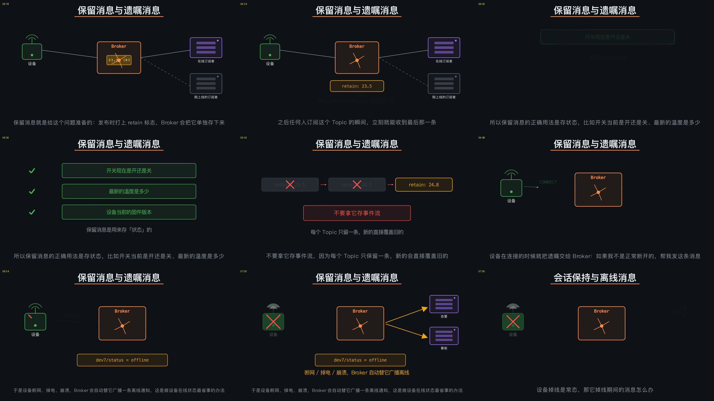

### 1. 清理会话（Clean Session / Clean Start）
* **MQTT 3.1.1** 使用 `CleanSession` 标志位；**MQTT 5.0** 拆分为 `CleanStart` + `Session Expiry Interval`（会话过期时间）。
* **Clean Session = True**：每次连接建立全新的临时会话，掉线期间以前的订阅关系和离线积压消息全清空。
* **Clean Session = False（持久会话）**：
  * 客户端重连时，Broker 根据稳定的 `Client ID` 找回历史会话。
  * **自动恢复订阅关系**，无需重复发送订阅请求。
  * **补发离线消息**：设备掉线期间累积的 **QoS 1 和 QoS 2 消息** 会被 Broker 缓存并在重连后顺畅补发（注：QoS 0 消息不予缓存）。

> [!CAUTION]
> **两大隐藏致命陷阱**：
> 1. **Client ID 必须全局唯一且绝对稳定**：切勿在客户端生成随机 UUID 作为 Client ID，否则持久会话永远失效。
> 2. **连接抖动（Connection Churn / Flapping）**：如果两个物理设备误用了相同的 Client ID，Broker 会先将旧设备踢下线；旧设备自动重连后又将新设备踢掉，形成无线互相踢出的雪崩现象。

### 2. 心跳保活（Keep Alive）与对抗运营商 NAT 静默回收
* **心跳协议**：连接时协商 Keep Alive 秒数（$T$）。如果在该周期内无业务数据，客户端发 `PINGREQ`，Broker 回 `PINGRESP`。若 Broker 在 $1.5 \times T$ 时间内未收到任何数据包，立即判定连接假死，强制断开并触发 LWT 遗嘱。
* **与 NAT 网关博弈**：运营商移动基站与 NAT 网关通常会在连接空闲几分钟后静默关闭映射表。因此 **Keep Alive 间隔必须设置得小于运营商 NAT 回收超时（通常在 60s ~ 120s 之间）**。

---

## 八、架构选型：MQTT vs Kafka

“既然都是发布订阅，为什么在物联网中不能直接用 Kafka 代替 MQTT？”

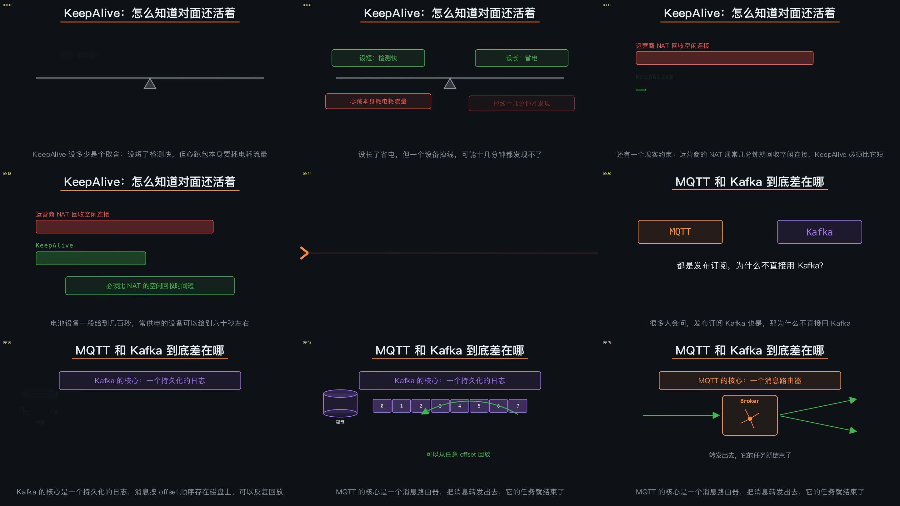

### 1. 核心维度对比

| 对比维度 | MQTT（物联网消息路由器） | Apache Kafka（分布式持久化日志流） |
| :--- | :--- | :--- |
| **本质定位** | 专注于消息实时路由与极低开销分发，发完即完成 | 专注于分布式、高吞吐、持久化存储的 Append-only 顺序日志，支持数据反复回放 |
| **并发连接数** | **几十万到数百万**级长连接直接挂载 | 通常仅支撑几百到几千个微服务/消费者节点 |
| **客户端体积** | 几 KB 到几十 KB，轻松烧录进嵌入式 MCU 固件 | 客户端包含复杂的批处理与分区再平衡逻辑，依赖库数 MB |
| **Topic 数量** | 动态轻量字符串，支持数百万级 Topic 树 | Topic/Partition 属于重量级资源，通常几千个就需要谨慎评估资源消耗 |
| **消费模型** | **推模型（Push）**：Broker 收到即刻推送给在线客户端 | **拉模型（Pull）**：消费者根据自身 offset 主动批量拉取 |

### 2. 业界黄金协同架构（MQTT + Kafka）
二者从来不是替代关系，而是上下游黄金搭档：
```
[海量 IoT 传感器 / 车载终端]
           │ (MQTT over TLS / 弱网长连接 / 毫秒级推送)
           ▼
[MQTT Broker 集群 (EMQX / HiveMQ)]
           │ (内部高性能数据桥接 / Data Bridge)
           ▼
[Apache Kafka 集群]
           │ (分区分发 / 顺序持久化 / 批量吞吐)
           ▼
[Flink 流计算 / 大数据平台 / 时序数据库 (IoTDB/ClickHouse)]
```

---

## 九、物联网安全三层防御体系

物联网设备一旦被攻破，往往造成物理破坏或数据批量泄露，必须构建从外到内的三层防护闭环：

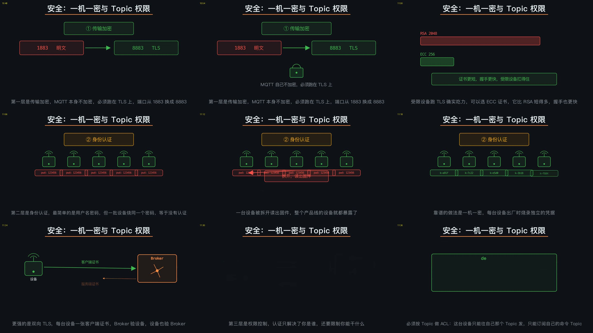

### 1. 传输层加密（Transport Security）
* 端口由标准非加密端口 `1883` 切换为安全加密端口 `8883`。
* **ECC 证书取代传统 RSA 证书**：对于计算能力受限的 MCU，采用基于椭圆曲线（ECC）的 SSL/TLS 证书。ECC 在相同安全强度下公钥和签名长度远短于 RSA，握手计算量显著降低，成倍节省闪存与运行时 RAM。

### 2. 身份认证（Authentication）
* ❌ **反面教材：全量设备硬编码同一套账号密码**。一旦某台外场设备被逆向攻破固件，整个产品线全部沦陷。
* ✅ **工业级实践**：
  * **一机一密**：每台设备在产线烧录时注入专属的设备标识与密钥。
  * **双向 TLS（mTLS）**：服务端验证设备客户端证书，设备也校验证书链，杜绝伪造与中间人劫持。

### 3. 授权访问控制（Authorization / ACL）
* **严控 Topic ACL**：基于客户端权限表，规定设备只能向专属路径（如 `devices/{clientid}/telemetry`）发布，且只能订阅专属命令路径（如 `devices/{clientid}/cmd`）。
* **防御攻击**：防止恶意设备利用通配符订阅 `#` 窃取全工厂数据，或者向他人主题恶意乱发控制指令。
* **强绑定校验**：Broker 端强制将认证证书中的 CN / 凭证标识与客户端连接报告的 `Client ID` 执行一致性校验，防范合谋借用合法凭证假冒他人节点。

---

## 十、观众讨论与观点提炼

在视频互动与弹幕反馈中，围绕传输层与应用层的技术选型产生了多维度的讨论：

* **CoAP（受限应用协议）与 UDP 的对比**：
  * 部分开发者提出为何不用基于 UDP 的 CoAP 协议？CoAP 开销比 MQTT 更小，且支持 RESTful 语义。
  * **工程实践取舍**：CoAP 适合极度受限且仅有单一采集需求的低频设备；但 UDP 难以穿透严苛的企业级防火墙与运营商 NAT，且在下发即时控制指令时需要面对无连接的复杂状态维护。MQTT 基于 TCP 的长连接在公网穿透力与实时双向交互上更具通用性。
* **网络层协议混淆纠正**：
  * 弹幕频繁出现“直接用 TCP/UDP 传输不就行了吗？”的疑问。
  * **正解**：TCP/UDP 是传输层协议，只解决端到端字节流传输；如果裸用 TCP，你依然要在其上定义数据包长度、心跳保活、主题路由与重传确认机制——而这一切手搓的协议规范，收敛起来就是 MQTT 所标准化的内容。

---

## 十一、总结速查思维导图

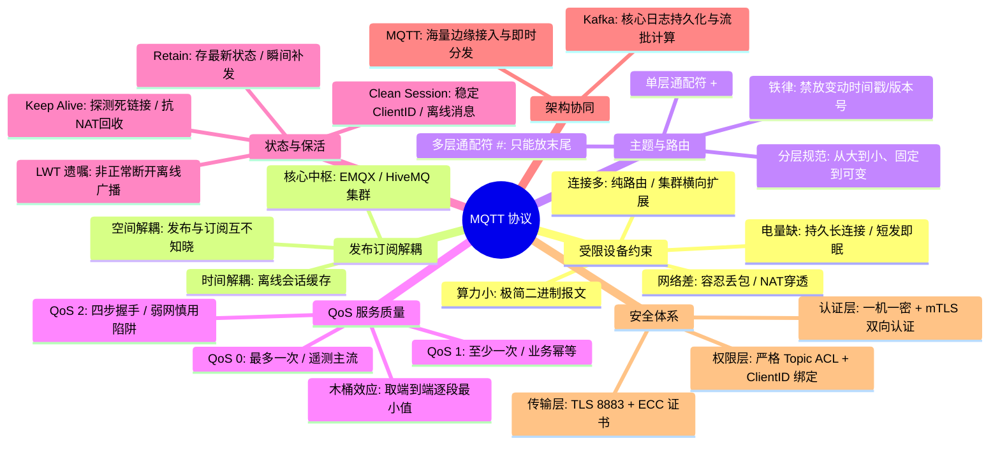
